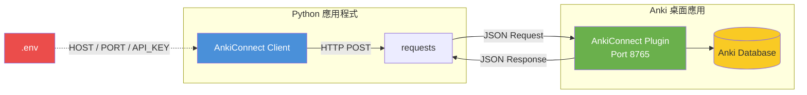
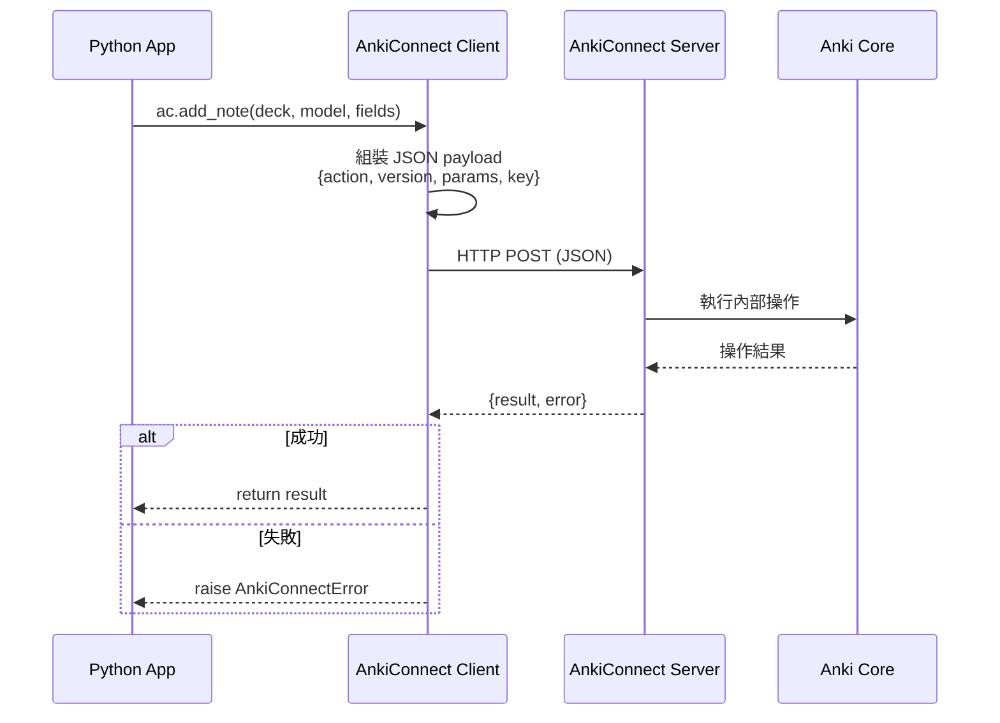
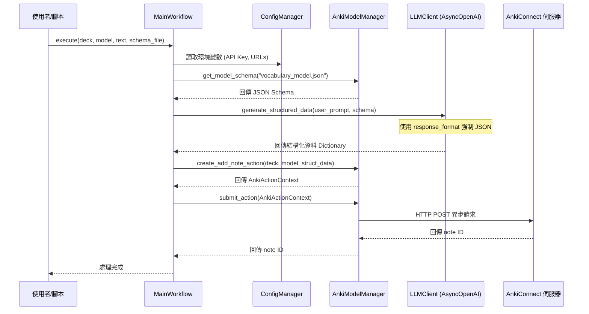
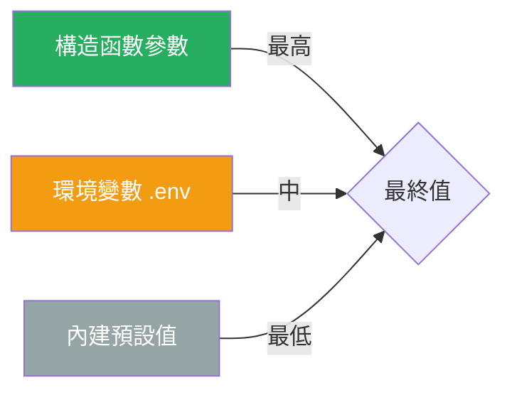
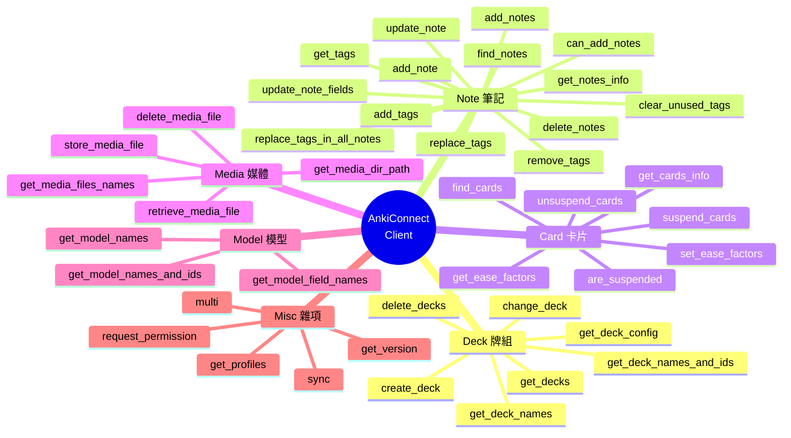
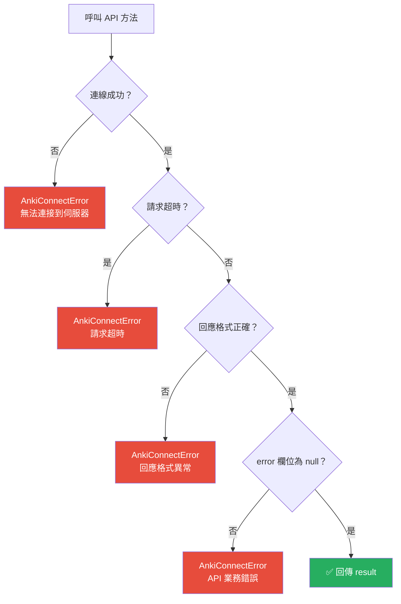

# 🃏 AnkiConnect Python Client

一個完整的 [AnkiConnect](https://git.sr.ht/~foosoft/anki-connect) API v6 Python 封裝庫，提供牌組、筆記、卡片、媒體、模型管理的 CRUD 操作。

---

## 📋 目錄

- [系統架構](#-系統架構)
- [LLM 自動化工具鏈](#-llm-自動化工具鏈)
- [前置需求](#-前置需求)
- [安裝](#-安裝)
- [配置](#-配置)
- [快速開始](#-快速開始)
- [API 總覽](#-api-總覽)
- [使用文檔](#-使用文檔)
  - [牌組操作 (Deck)](#牌組操作-deck)
  - [筆記操作 (Note)](#筆記操作-note)
  - [卡片操作 (Card)](#卡片操作-card)
  - [媒體操作 (Media)](#媒體操作-media)
  - [模型操作 (Model)](#模型操作-model)
  - [雜項操作 (Misc)](#雜項操作-misc)
- [錯誤處理](#-錯誤處理)
- [專案結構](#-專案結構)

---

## 🏗 系統架構



### 請求 / 回應流程



---

## 🤖 LLM 自動化工具鏈

提供了一套高內聚、低耦合的物件導向自動化工具庫，專為「將 LLM 輸出可靠地轉換為 Anki 卡片」設計。此模組採用強嚴格型別校驗與 `pydantic` 控制。

### 模組介紹
1. **`config_manager.py`**: 讀取 `.env` 並配置 `pydantic-settings` 與全局 Log。
2. **`llm_client.py`**: 封裝非同步 `AsyncOpenAI`，負責向兼容 OpenAI 格式之 LLM (如 Gemini) 發出請求，並強制約束 JSON 回傳。
3. **`anki_model_manager.py`**: 掃描 `./anki_models/` 中的 JSON Schema 檔案作為 LLM Response Format，並封裝 `AnkiConnect` 的 Action，利用 `httpx` 非同步發送請求。
4. **`main_workflow.py`**: 提供給終端使用者的自動化進入點。

### 自動化工作流架構



### 自動化使用範例

```python
import asyncio
from main_workflow import MainWorkflow, config

async def main():
    config.setup_logging()
    workflow = MainWorkflow()
    
    # 預設會去 ./anki_models/vocabulary_model.json 尋找 Schema 限制 LLM 輸出
    note_id = await workflow.execute(
        deck_name="Default",
        model_name="基本",
        user_prompt="Ephemeral: lasting for a very short time. Example: Fashions are ephemeral.",
        model_schema_file="vocabulary_model.json",
        system_prompt="你是一位專業英文教師，請為學生抽取出單字含義與例句，並強制輸出給定的 JSON 格式。",
        tags=["vocabulary", "ephemeral", "english"]
    )
    print(f"成功新增筆記！ID: {note_id}")

asyncio.run(main())
```

### 內建複雜模型：TOEIC_Coach 案例
此工具鏈自帶一個 `TOEIC_Coach` 複雜卡片模型定義（位於 `anki_models/` 底下）。這是針對大語言模型特性所最佳化的 Anki 卡片版型。

1. **核心概念：**
   透過 `TOEIC_Coach.json` 將單字的例句「語塊化」(Chunking)，並透過 LLM 引導出語感、同義詞比較與必考搭配詞 (Collocations)。
2. **檔案組成：**
   - `TOEIC_Coach.json`：包含 `modelName`、`inOrderFields` 以及專屬的 `llm_schema` 巢狀參數設定，完美橋接安基生卡邏輯與 OpenAI 結構化輸出請求。
   - `TOEIC_Coach_front/back.html`：簡約大方的卡片正背面設計。支援利用 `{{#Field}}` 隱藏空欄位。
   - `TOEIC_Coach_style.css`：專業的多益配色（深藍 `#1a3a5f`、強調橘 `#e67e22`）與一體化響應式排版。

### 模型匯入工具 (Model Importer)
為了免除手動設定繁瑣的 HTML/CSS 與欄位，您可以使用專屬腳本 `import_model.py` 直接將 `anki_models/` 中的模型安裝至 Anki。

```bash
# 一鍵匯入 TOEIC_Coach 模型至您的 Anki
python import_model.py TOEIC_Coach
```
*這將自動讀取 `.json`, `_front.html`, `_back.html`, `_style.css` 並透過 AnkiConnect API 完成註冊。*

---

## ✅ 前置需求

| 項目 | 版本要求 |
|------|---------|
| Python | ≥ 3.8 |
| Anki 桌面版 | ≥ 2.1.x |
| AnkiConnect 插件 | 最新版本 |

> **AnkiConnect 安裝方式：**  
> 打開 Anki → 工具 → 附加元件 → 獲取附加元件 → 輸入代碼 `2055492159` → 重啟 Anki

---

## 📦 安裝

```bash
# 安裝依賴
pip install -r requirements.txt
```

**依賴套件：**

| 套件 | 用途 |
|------|------|
| `requests` | HTTP 請求 |
| `python-dotenv` | 環境變數管理 |

---

## ⚙️ 配置

複製範本並填入你的配置：

```bash
cp .env.example .env
```

編輯 `.env`：

```env
# AnkiConnect 伺服器設定
ANKI_CONNECT_HOST=127.0.0.1    # 伺服器地址（本機預設）
ANKI_CONNECT_PORT=8765          # 伺服器端口（預設 8765）
ANKI_CONNECT_API_KEY=           # API 金鑰（選填，僅伺服器啟用認證時需要）
```

### 配置載入優先順序



```python
# 方式 1：使用 .env 預設配置
ac = AnkiConnect()

# 方式 2：覆蓋部分配置
ac = AnkiConnect(host='192.168.1.100', api_key='my_secret')
```

---

## 🚀 快速開始

```python
from utils.anki_connect import AnkiConnect

# 初始化客戶端
ac = AnkiConnect()

# 驗證連線
print(f"AnkiConnect 版本: {ac.get_version()}")  # 6

# 建立牌組
ac.create_deck("English::Vocabulary")

# 新增筆記
note_id = ac.add_note(
    deck_name="English::Vocabulary",
    model_name="Basic",
    fields={"Front": "apple", "Back": "蘋果 🍎"},
    tags=["fruit", "english"],
)
print(f"新筆記 ID: {note_id}")

# 搜尋筆記
ids = ac.find_notes("deck:English::Vocabulary")
print(f"找到 {len(ids)} 則筆記")

# 更新筆記
ac.update_note(note_id=note_id, fields={"Back": "蘋果 🍎 — a round fruit"})

# 同步到 AnkiWeb
ac.sync()
```

---

## 📖 API 總覽



### 方法速查表

| 分類 | 方法 | 說明 | 回傳值 |
|:----:|------|------|--------|
| **Deck** | `get_deck_names()` | 取得所有牌組名稱 | `List[str]` |
| | `get_deck_names_and_ids()` | 取得牌組名稱與 ID | `Dict[str, int]` |
| | `create_deck(deck)` | 建立新牌組 | `int` |
| | `delete_decks(decks)` | 刪除牌組 | `None` |
| | `get_deck_config(deck)` | 取得牌組設定 | `Dict` |
| | `change_deck(cards, deck)` | 移動卡片到其他牌組 | `None` |
| | `get_decks(cards)` | 根據卡片取得所屬牌組 | `Dict[str, List[int]]` |
| **Note** | `add_note(...)` | 新增筆記 | `Optional[int]` |
| | `add_notes(notes)` | 批次新增筆記 | `List[Optional[int]]` |
| | `update_note(...)` | 更新筆記欄位與標籤 | `None` |
| | `update_note_fields(...)` | 僅更新欄位 | `None` |
| | `delete_notes(notes)` | 刪除筆記 | `None` |
| | `find_notes(query)` | 搜尋筆記 | `List[int]` |
| | `get_notes_info(...)` | 取得筆記詳情 | `List[Dict]` |
| | `add_tags(notes, tags)` | 新增標籤 | `None` |
| | `remove_tags(notes, tags)` | 移除標籤 | `None` |
| | `get_tags()` | 取得所有標籤 | `List[str]` |
| | `replace_tags(...)` | 替換標籤 | `None` |
| | `can_add_notes(notes)` | 檢查是否可新增 | `List[bool]` |
| **Card** | `find_cards(query)` | 搜尋卡片 | `List[int]` |
| | `get_cards_info(cards)` | 取得卡片詳情 | `List[Dict]` |
| | `suspend_cards(cards)` | 暫停卡片 | `bool` |
| | `unsuspend_cards(cards)` | 取消暫停 | `bool` |
| | `get_ease_factors(cards)` | 取得簡易度因子 | `List[int]` |
| | `set_ease_factors(...)` | 設定簡易度因子 | `List[bool]` |
| | `are_suspended(cards)` | 批次檢查暫停狀態 | `List[Optional[bool]]` |
| **Media** | `store_media_file(...)` | 儲存媒體檔案 | `str` |
| | `retrieve_media_file(filename)` | 讀取媒體檔案 | `str \| bool` |
| | `get_media_files_names(pattern)` | 搜尋媒體檔案 | `List[str]` |
| | `delete_media_file(filename)` | 刪除媒體檔案 | `None` |
| | `get_media_dir_path()` | 取得媒體資料夾路徑 | `str` |
| **Model** | `get_model_names()` | 取得所有模型名稱 | `List[str]` |
| | `get_model_names_and_ids()` | 模型名稱與 ID | `Dict[str, int]` |
| | `get_model_field_names(model)` | 取得模型欄位 | `List[str]` |
| **Misc** | `get_version()` | API 版本 | `int` |
| | `sync()` | 同步 AnkiWeb | `None` |
| | `request_permission()` | 請求權限 | `Dict` |
| | `get_profiles()` | 取得使用者列表 | `List[str]` |
| | `multi(actions)` | 批次執行多個動作 | `List[Any]` |

---

## 📚 使用文檔

### 牌組操作 (Deck)

```python
from utils.anki_connect import AnkiConnect

ac = AnkiConnect()

# ---- 查詢 ----
# 取得所有牌組
decks = ac.get_deck_names()
# ['Default', 'Japanese::JLPT N3']

# 取得牌組名稱和 ID
deck_map = ac.get_deck_names_and_ids()
# {'Default': 1, 'Japanese::JLPT N3': 1519323742721}

# 取得特定牌組的設定
config = ac.get_deck_config("Default")
print(f"每日新卡片數: {config['new']['perDay']}")  # 20

# 根據卡片 ID 查看所屬牌組
card_decks = ac.get_decks([1502298036657, 1502032366472])
# {'Default': [1502032366472], 'Japanese::JLPT N3': [1502298036657]}

# ---- 建立 ----
# 建立牌組（支援巢狀結構）
deck_id = ac.create_deck("English::Grammar::Tenses")

# ---- 修改 ----
# 移動卡片到其他牌組
ac.change_deck(cards=[1502098034045], deck="Japanese::JLPT N3")

# ---- 刪除 ----
ac.delete_decks(["English::Grammar::Tenses"])
```

---

### 筆記操作 (Note)

#### 新增筆記

```python
# 基礎筆記
note_id = ac.add_note(
    deck_name="Default",
    model_name="Basic",
    fields={"Front": "ephemeral", "Back": "短暫的；轉瞬即逝的"},
    tags=["GRE", "vocabulary"],
)

# 帶媒體附件的筆記
note_id = ac.add_note(
    deck_name="Default",
    model_name="Basic",
    fields={
        "Front": "How to pronounce 'cat' in Japanese?",
        "Back": "ねこ（猫）",
    },
    audio=[{
        "url": "https://assets.languagepod101.com/dictionary/japanese/audiomp3.php?kanji=猫&kana=ねこ",
        "filename": "neko.mp3",
        "fields": ["Front"],
    }],
    tags=["japanese"],
)

# 允許重複筆記
note_id = ac.add_note(
    deck_name="Default",
    model_name="Basic",
    fields={"Front": "test", "Back": "test"},
    allow_duplicate=True,
    duplicate_scope="deck",
)

# 批次新增
ids = ac.add_notes([
    {"deckName": "Default", "modelName": "Basic",
     "fields": {"Front": "Q1", "Back": "A1"}, "tags": ["batch"]},
    {"deckName": "Default", "modelName": "Basic",
     "fields": {"Front": "Q2", "Back": "A2"}, "tags": ["batch"]},
])
```

#### 搜尋與查詢

```python
# 使用 Anki 搜尋語法
ids = ac.find_notes("deck:Default")             # 指定牌組
ids = ac.find_notes("tag:english")               # 指定標籤
ids = ac.find_notes("added:7")                   # 最近 7 天
ids = ac.find_notes('"front content"')           # 包含特定文字
ids = ac.find_notes("deck:Default tag:english")  # 組合條件

# 取得筆記詳細資訊
infos = ac.get_notes_info(notes=[1502298033753])
for info in infos:
    print(f"模型: {info['modelName']}")
    print(f"標籤: {info['tags']}")
    for name, field in info["fields"].items():
        print(f"  {name}: {field['value']}")

# 也可用查詢語句取得筆記資訊
infos = ac.get_notes_info(query="deck:Default")

# 預檢：建立前確認筆記是否合法
results = ac.can_add_notes([{
    "deckName": "Default",
    "modelName": "Basic",
    "fields": {"Front": "test", "Back": "test"},
}])
# [True] or [False]
```

#### 更新筆記

```python
# 更新欄位和標籤
ac.update_note(
    note_id=1514547547030,
    fields={"Front": "new question", "Back": "new answer"},
    tags=["updated"],
)

# 僅更新欄位
ac.update_note_fields(
    note_id=1514547547030,
    fields={"Back": "corrected answer"},
)
```

#### 標籤管理

```python
# 新增標籤（多個標籤以空格分隔）
ac.add_tags([1483959289817, 1483959291695], "english vocabulary")

# 移除標籤
ac.remove_tags([1483959289817], "old-tag")

# 替換標籤
ac.replace_tags([1483959289817], "old-tag", "new-tag")

# 全域替換標籤
ac.replace_tags_in_all_notes("european-languages", "french")

# 取得所有標籤
all_tags = ac.get_tags()

# 清除未使用的標籤
ac.clear_unused_tags()
```

#### 刪除筆記

```python
ac.delete_notes([1502298033753, 1502298033754])
```

---

### 卡片操作 (Card)

```python
# 搜尋卡片
card_ids = ac.find_cards("deck:Default is:due")

# 取得卡片詳情
infos = ac.get_cards_info(card_ids[:5])

# 暫停 / 取消暫停
ac.suspend_cards([1483959291685])
ac.unsuspend_cards([1483959291685])

# 批次檢查暫停狀態
statuses = ac.are_suspended([1483959291685, 9999999999999])
# [False, None]  — None 表示卡片不存在

# 讀取 / 設定簡易度因子
factors = ac.get_ease_factors([1483959291685])
ac.set_ease_factors([1483959291685], [2500])
```

---

### 媒體操作 (Media)

```python
import base64

# 從 URL 儲存
ac.store_media_file(filename="cat.jpg", url="https://example.com/cat.jpg")

# 從 Base64 儲存
data = base64.b64encode(b"Hello, world!").decode()
ac.store_media_file(filename="_hello.txt", data=data)

# 從本地檔案儲存
ac.store_media_file(filename="doc.pdf", path="/path/to/doc.pdf")

# 讀取檔案（回傳 Base64）
content = ac.retrieve_media_file("_hello.txt")
if content:
    print(base64.b64decode(content).decode())

# 搜尋媒體檔案
mp3_files = ac.get_media_files_names("*.mp3")

# 取得媒體資料夾路徑
media_dir = ac.get_media_dir_path()

# 刪除檔案
ac.delete_media_file("old_file.txt")
```

---

### 模型操作 (Model)

```python
# 取得所有模型名稱
models = ac.get_model_names()
# ['Basic', 'Basic (and reversed card)', 'Cloze']

# 取得模型名稱和 ID
model_map = ac.get_model_names_and_ids()
# {'Basic': 1483883011648, 'Cloze': 1483883011630}

# 取得模型的欄位名稱
fields = ac.get_model_field_names("Basic")
# ['Front', 'Back']
```

---

### 雜項操作 (Misc)

```python
# 取得 AnkiConnect 版本
version = ac.get_version()  # 6

# 請求 API 權限
perm = ac.request_permission()
# {'permission': 'granted', 'requireApiKey': False, 'version': 6}

# 同步至 AnkiWeb
ac.sync()

# 取得使用者設定檔列表
profiles = ac.get_profiles()  # ['User 1']

# 批次執行多個動作（單一請求）
results = ac.multi([
    {"action": "deckNames"},
    {"action": "version"},
    {"action": "getTags"},
])
decks, version, tags = results
```

---

## ⚠️ 錯誤處理



```python
from utils.anki_connect import AnkiConnect, AnkiConnectError

ac = AnkiConnect()

try:
    ac.add_note(
        deck_name="Default",
        model_name="NonExistent",
        fields={"Front": "test", "Back": "test"},
    )
except AnkiConnectError as e:
    print(f"操作失敗: {e.message}")
    # 操作失敗: model was not found: NonExistent
```

### 常見錯誤與解決方案

| 錯誤訊息 | 原因 | 解決方案 |
|---------|------|---------|
| 無法連接到 AnkiConnect 伺服器 | Anki 未啟動或插件未安裝 | 啟動 Anki 並安裝 AnkiConnect |
| model was not found | 指定的模型不存在 | 使用 `get_model_names()` 確認可用模型 |
| cannot create note because it is a duplicate | 筆記重複 | 設定 `allow_duplicate=True` 或更換內容 |
| deck was not found | 牌組不存在 | 先用 `create_deck()` 建立牌組 |

---

## 📁 專案結構

```
anki/
├── .env                 # 環境變數配置（含敏感資訊，不可提交至版控）
├── .env.example         # 環境變數範本
├── anki_connect.py      # AnkiConnect CRUD 類別
├── requirements.txt     # Python 依賴套件
└── README.md            # 本文件
```

---

